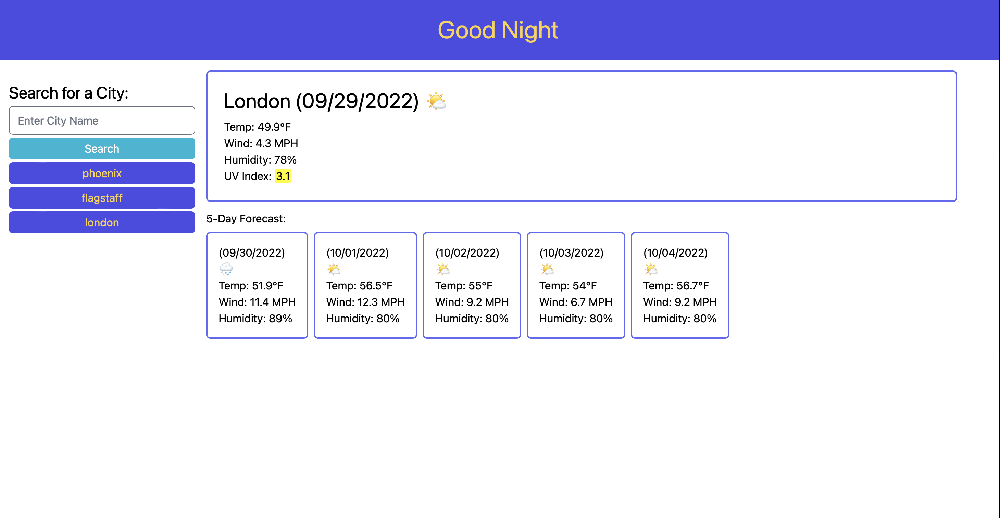

# Code Challenge 06 Server Side APIs: Weather Display

## Description

The Weather Display aplication was the sixth challenge in our web development bootcamp. It was designed to challenge us with applying 
what we had learned that week about server side APIs. Some of the new tools I used were:
- Using a fetch method to get data from server side API
- Using tailwind to provide CSS styling
- Using query parameters to get specific data from the API

## Installation

N/A

## Usage

To use this application you can type the name of any city you would weather information for. Once you submit a valid city name the weather data for that day will pop up and a 5 day forecast will 
apppear beneath that. Any errors thrown by the fetch are caught and an alert will pop up if a empty string is submitted. The uv index will be color coded based on its 
value: green = low, yellow = moderate, orange = high, red = very high, purple = extreme. An emoji will also appear in the main display and forecast display signifying the local weather conditions. 
The application is also able to save and display previous searches. To visit the deployed application follow this link: 
https://trufl.github.io/weather-application/

    

## Credits

N/A

## License

N/A